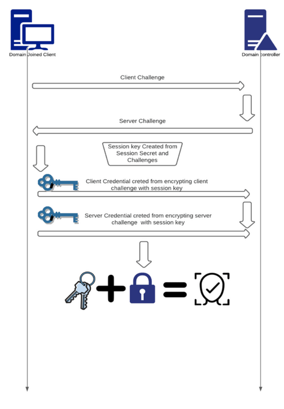
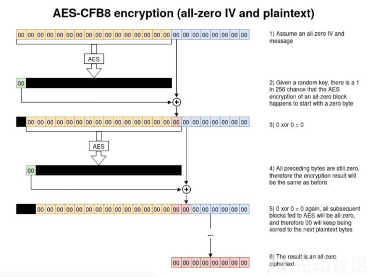
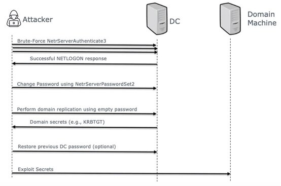
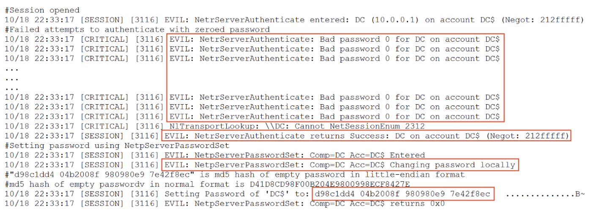
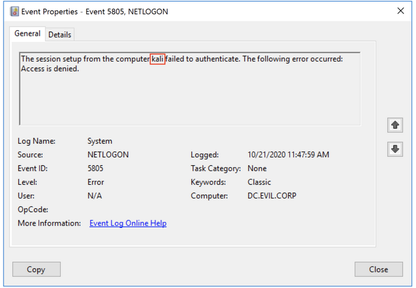
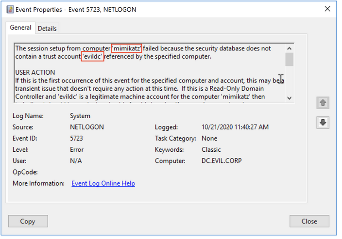
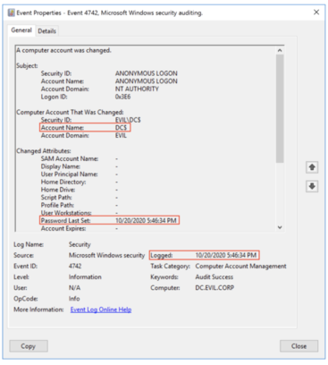
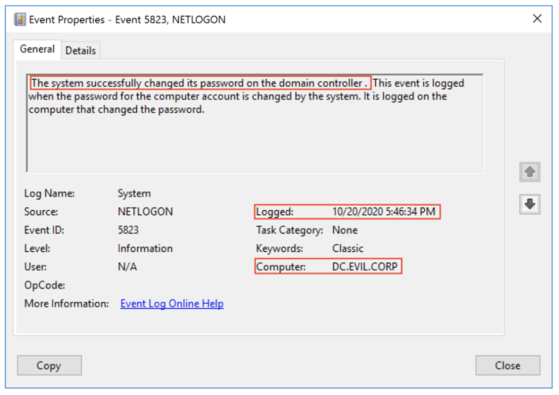
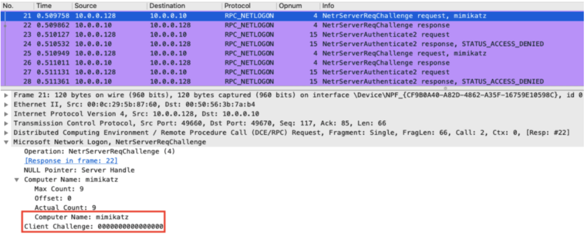
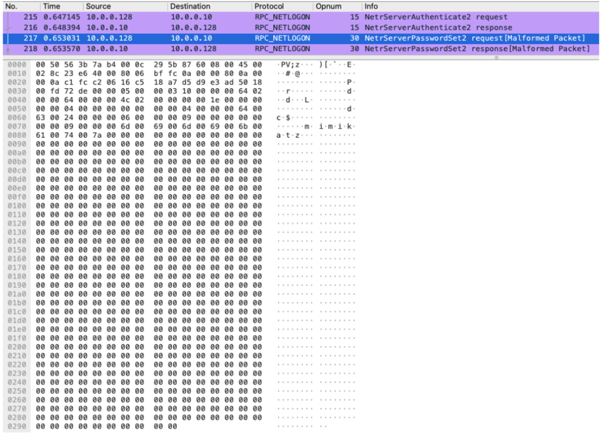

# ZeroLogon(CVE-2020-1472) 

*Zhen Meng, Zhixin Han*

## What is ZeroLogon

It is a kind of unauthenticated privilege escalation to full domain privileges. [6]

In September 2020 Secura published an article about this vulnerability in Windows Server (all known versions) Netlogon Remote Protocol. This vulnerability is known as CVE-2020-1472 or more commonly, Zerologon.

Zerologon poses a major threat to organizations as it targets the [Domain Controller (DC)](https://jumpcloud.com/blog/what-is-a-domain-controller). A domain controller is a computer server that responds to security authentication requests and verifies users on the domain. This is the most critical Active Directory vulnerability discovered in 2020. [2]

This vulnerability allows an unauthenticated attacker with network access to a domain controller, to establish a vulnerable Netlogon session and eventually gain domain administrator privileges. The vulnerability is especially severe since the only requirement for a successful exploit is the ability to establish a connection with a domain controller.

## NetLogon Protocol

According to Microsoft, “The Netlogon Remote Protocol is a remote procedure call (RPC) interface used for user and machine authentication on domain-based networks. The Netlogon Remote Protocol RPC interface is also used to replicate the database for backup domain controllers (BDCs).

The Netlogon Remote Protocol is used to maintain domain relationships between the members of a domain and the domain controller (DC), among DCs for a domain, and between DCs across domains. This RPC interface is used to discover and manage these relationships. The main issue this scheme has is because of the way Client and server Credentials are computed a basic flow in a primitive cryptography type is implemented wrongly.



1. A Client Challenge is sent from the Client
2. A Server Challenge is sent from the server
3. A Session key is created from session secret and challenges
4. Both client and server utilize the previously made session key to and the Challenges to create client/server credentials
5. Both credentials together with the session key will be used to authenticate the user
The main issue this scheme has is because of the way Client and server Credentials are computed a basic flow in a primitive cryptography type is implemented wrongly.

## AES-CFB8 ENCRYPTION

The ComputeNetlogonCredential Function uses a encrypting component called AES-CFB8 Encryption. The implementation of this encryption is unsecure, which results in a cryptographic flaw. AES-CFB8 is a controlled mode of AES Encryption (AES receives 16 bytes and returns a value of the same length) which is meant to receive 8 bytes.

To use AES-CFB8 encryption, a random initialization vector (IV) needs to be generated for every plaintext to be encrypted using the same key. The received 8 bytes is attached to the IV.

AES Encryption is then applied to the vector and the first byte of the value of the result is then used to *XOR* the first byte of the 8-byte expression on which the protocol is used, and repeats those steps until the phrase is all encoded.



## Exploit Steps [6]

The core of the vulnerability lies in a poor implementation of the ComputeNetlogonCredential call of the Netlogon Remote Protocol.

The ComputeNetlogonCredential takes an 8-byte challenge as an input, performs a cryptographic transformation using a session key, and outputs an 8-byte result. This transformation uses AES-CFB8 method. 

1. When the exploitation happens, attacker tries to build a channel against a domain controller by performing a brute-force attack. using an 8 zero-bytes challenge and ciphertext. These requests all contain only 0’s for the credentials and results in a successful logon when a ‘good key’ is chosen by the server. This would require an average of 256 attempts.

2. Using the NetrServerPasswordSet2 to change the domain controller account’s password to empty. It breaks some of the domain controller functionality.

3. Using the empty password to connect to the domain controller and performing domain replication. The attacker can dump hashes using the Domain Replication Service (DRS) protocol.

4. Because the password stored in the domain controller’s registry would not change in step 2, the attacker needs to revert to original one. So that it can hardly be detected.

By using hashes dumped previously, other attacks can be performed using domain administrator credentials.



## Methods of Detection [1]

- Detection using the Netlogon debugging log
- Detection of artifacts left by exploits
- Detection, based on the differences between legitimate password changes and thoes caused by exploits
- Detecting exploitation based on network traffic

## Detection using the Netlogon debugging log 

```
command:nltest /dbflag:0x2080ffff
```

The vulnerability is exploited in the Netlogon protocol, we can utilize the Netlogon event log. By default, only a fraction of the events in the Windows logs are audited, but you can enable the Netlogon debug mode using the command above, which must be run with administrator privileges. The Netlogon service will then save most of the important events to the log file.  The graph shows a few interesting lines that were logged by the Netlogon service during the exploitation of the Zerologon vulnerability.When Netlogon debug mode is configured, every step of the attack is logged and retaining even the MD5 password hash that was set for the domain controller account.




## Detecting Artifacts left by Exploit

```
(EventID = ‘5805’ OR EventID = ‘5723’) AND (Message contains ‘kali’ OR Message contains ‘mimikatz’)
```

The first stage of the exploitation process is brute force. This exploit carries out multiple authentication attempts using Netlogon on a domain controller with a ClientChallenge message consisting of 8 zero bytes.

The exploit would use multiple authentication attemps on a domain controller with cilent challenge message consisting of 8 zero byters. Multiple failed authentication attempts would lead to the generation of event 5805 on  the doman controller appeared on the graph.
In addition, if an incorrect domain controller account name was specified in the exploit, the attempt to authnticate with incorrect account will generate event 5723 on the domain controller.

In order to find this exploit, we use this condition to find the the artifcacts in the from of a kali substring remained in events 5805 and 5723.




## Detection, based on the differences between password changes

We'll now look at detection methods based on a different set of events, such as when the computer account password is updated on a regular basis and when it's changed with Zerologon.
The computer account password has a maximum validity period of 30 days by default. When this period expires, the operating system will change the password using the Netlogon protocol.

When a computer account's password is changed, several events are recorded in the Security event log. The first is an event with EventID 4742 'A computer account was changed,' which has a TargetUserName equal to the domain controller account's name and PasswordLastSet set to the date the password was changed. This event indicates that the domain controller computer account's password has been changed.

The System event log also contains another  event with EventID 5823 — ‘The system successfully changed its password on the domain controller.’. This event means that the computer account has been legitimately changed by the system, demonstrated on the right graph.

When a legitimate password change is performed for a domain controller account, two events are generated: 5823 and [4742](https://www.ultimatewindowssecurity.com/securitylog/encyclopedia/event.aspx?eventid=4742). When using Zerologon, however, event 5823 is not recorded in the event log.

Thus, the logic of detection can be viewed from this angle. We previously stated that brute force is the first stage of exploitation. As a result, detecting both [5805](https://kb.eventtracker.com/evtpass/evtpages/EventId_5805_NetLogon_47953.asp) and 4742 events on the same domain controller within one minute indicates that Zerologon has been successfully exploited.

The logic of our third rule for detecting the exploitation of Zerologon may look like this:
when both of (EventID = ‘4742’ AND TargetUserName IN “Domain_Controller_Accounts_List” AND PasswordLastSet != ‘-’) and (EventID = ‘5805’) were detected on the same host within 1 minute.




## Detecting exploitation based on network traffic

The first step in exploiting the vulnerability is to send a *ClientChallenge* with a zero key value to bypass authentication. In practise, it takes at least ten attempts to bypass the authentication mechanism. This anomaly can be easily detected in network traffic. The RPC protocol is used to send ServerChallenge requests to the interface via the NetrServerReqChallenge method and attempts to authenticate via the NetrServerAuthenticate method with a zero ClientChallenge value.

An attack can be detected in a few seconds using the NetrServerReqChallenge and NetrServerAuthenticate2 repetitive methods in traffic from a single source.

An empty password is set for the domain controller computer account in the final phase of the NetrServerPasswordSet2  attack with a sequence of 516 zero bytes.

This allows for the detection of a Zerologon attack by examining network traffic in a short period of time through an abnormally large number of single-source RPC requests with pairs of NetrServerReqChallenge and NetrServerAuthenticate methods. Under certain conditions, the activity can be identified more precisely based on unique artefacts in traffic rather than statistical anomalies.




## Security Patch by Microsoft

[Part 1 (August 2020)](https://msrc.microsoft.com/update-guide/vulnerability/CVE-2020-1472):

- Enforces secure RPC usage for machine accounts on Windows based devices, for trust accounts, and for all Windows and non-Windows DCs
New group policy to allow non-compliant device accounts 
- Even when DCs are running in enforcement mode or after the enforcement phase starts, allowed devices will not be refused connection
- FullSecureChannelProtection registry key

Part 2 (February 2021): 

- Settings change to handle insecure connections
- Enforces secure RPC usage for machine accounts on non-Windows
- Logging of Event ID 5829 will be removed [5]

The first phase addressed the underlying vulnerability on two fronts. Firstly, patched DCs will block both Windows-based domain members and non-Windows DCs that are configured to explicitly disable signing/encryption. Secondly, the patch also changes the Netlogon protocol for clients unable to use the required signing/encryption. This change mathematically strengthens the defense against Zerologon, making it exponentially more difficult to exploit.

The second phase of this two-part patch rollout relates to a settings change to handle insecure connections from third-party / non-Windows devices that don’t or can’t use the required signing/encryption. [4]

## References

[1]: Hunting for Zerologon [Link](https://bi-zone.medium.com/hunting-for-zerologon-f65c61586382).

[2]: Zerologon Vulnerability: Analysis and Detection Tools [Link](https://www.cynet.com/zerologon/).

[3]: What is Zerologon?:[Link](https://www.trendmicro.com/en_us/what-is/zerologon.html)

[4]: CVE-2020-1472: Microsoft Finalizes Patch for Zerologon to Enable Enforcement Mode by Default [Link](https://www.tenable.com/blog/cve-2020-1472-microsoft-finalizes-patch-for-zerologon-to-enable-enforcement-mode-by-default)

[5]: How to manage the changes in Netlogon secure channel connections associated with CVE-2020-1472 [Link](https://support.microsoft.com/en-us/topic/how-to-manage-the-changes-in-netlogon-secure-channel-connections-associated-with-cve-2020-1472-f7e8cc17-0309-1d6a-304e-5ba73cd1a11e)

[6]: Zerologon (CVE-2020-1472): An Unauthenticated Privilege Escalation to Full Domain Privileges: [Link](https://www.crowdstrike.com/blog/cve-2020-1472-zerologon-security-advisory/)
